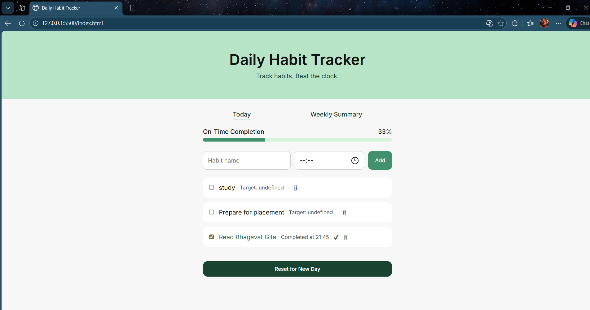

# ⏱ Daily Habit Tracker

A time-aware habit tracking web app that tracks not just task completion,
but whether habits are completed on time.

## 🚀 Features
- Add daily habits with target completion time
- Track on-time vs late completion
- Progress based only on on-time habits
- Automatic midnight reset
- Delete mistakenly added habits
- Data persistence using localStorage

## 🛠 Tech Stack
- HTML
- CSS
- JavaScript
- localStorage

## 📸 Screenshots
### Home Page

## 📌 Future Improvements
- React version
- Habit streaks
- Weekly analytics

---
Built with ❤️ as a learning project
